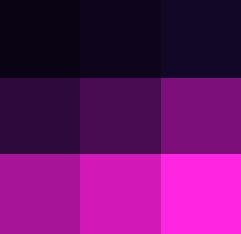
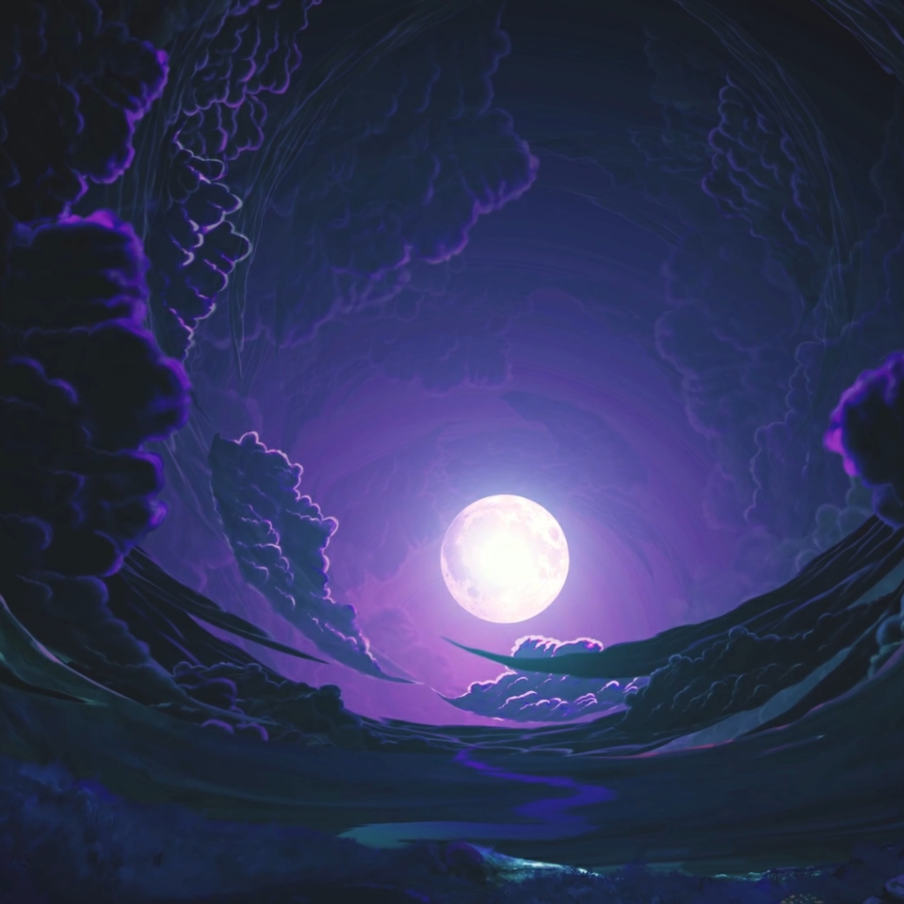
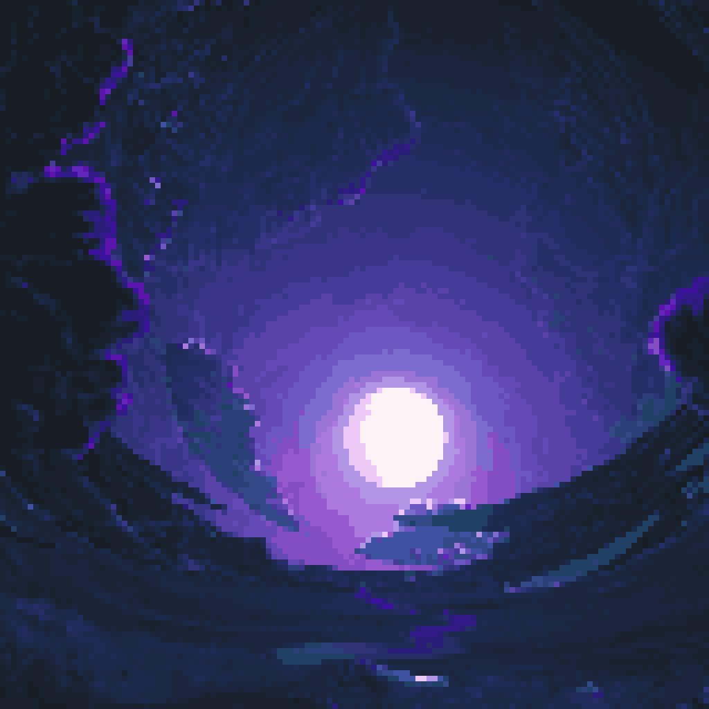

<h1 align="center">
  <br/>
  Img2Pixel
</h1>

<p align="center">
  
  
  
  
</p>

<div align="center">
A browser-based tool for converting images into pixel art. Runs client-side with no external dependencies, supporting custom palettes, dithering, edge smoothing, and outline generation.
</div>

<br/>

<div align="center">
  <table>
    <tr>
      <th style="text-align: center">Original</th>
      <th style="text-align: center">Pixelated</th>
    </tr>
    <tr>
      <td></td>
      <td></td>
    </tr>
  </table>
</div>

---

## Quick Start

### 1. GitHub Pages (Online)

Use the hosted version directly in your browser [here](https://meangrinch.github.io/Img2Pixel/).

### 2. Standalone (Offline)

Download `Img2Pixel.html` from [Releases](https://github.com/meangrinch/Img2Pixel/releases) or the repository root and open it in any browser.

### 3. From Source

```bash
git clone https://github.com/meangrinch/Img2Pixel.git
cd Img2Pixel
python scripts/build.py
```

---

## Features

- **Pixelation**: Downsample images to custom pixel-grid sizes
- **Palettes**: Generate adaptive palettes, pick from 26 built-in palettes (Game Boy, NES, PICO-8...), or sample one from an image
- **Style Presets**: Apply one-click looks for classic consoles and computers (Game Boy, SNES, Master System, Apple II...)
- **Dithering**: Apply error diffusion (Floyd-Steinberg, Atkinson, Burkes, Sierra) or Bayer ordered dithering (2x2, 4x4, 8x8)
- **Smoothing**: Remove isolated stray pixels and clean up cluster edges
- **Outlines**: Add outer borders, edge strokes, or internal color-boundary outlines
- **Preview**: Compare edits with a split slider, side-by-side view, hold-to-peek, pixel grid overlay, and up to 3200% zoom
- **Export**: Save as PNG, JPEG, or WebP (native, source size, or 2x-16x upscaled), or copy to the clipboard

---

## Support the Project

Img2Pixel is open-source and free. If it saves you time or enhances your workflow, consider supporting its development!

<p align="center">
  <a href="https://ko-fi.com/grinnch" target="_blank">
    
  </a>
</p>

---

## License & Credits

- License: Apache-2.0 (see [LICENSE](LICENSE))
- Author: [grinnch](https://github.com/meangrinch)
